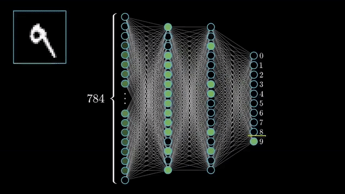

# Building GANs, Diffusers & Transformer Models with Neural Networks

## 1  Neural Networks—Digital “Brain Cells” of AI

Neural networks are computing systems inspired by the way biological neurons pass electrical signals.

* **Neurons** (nodes) receive numbers, multiply them by **weights** (adjustable “volume knobs”), add a **bias**, and push the result through a **non-linear activation**.
* By tweaking those weights across thousands of training steps, the network turns raw inputs—pixels, audio samples, text tokens—into useful predictions, classifications, or generated content.

---

## 2  How a Neural Network Works

| Stage                | What Happens                                                                                                                                                         | Everyday Analogy                                              |
| -------------------- | -------------------------------------------------------------------------------------------------------------------------------------------------------------------- | ------------------------------------------------------------- |
| **Input layer**      | Raw features enter (e.g., 784 pixel values).                                                                                                                         | Typing numbers into a calculator.                             |
| **Hidden layers**    | Each neuron computes  $z = \sum w_i x_i + b$  then applies an activation (ReLU, Sigmoid, Tanh). Stacking layers lets the model capture complex, non-linear patterns. | Water flows through pipes; valves (weights) control the flow. |
| **Output layer**     | Final activations become probabilities, coordinates, tokens, etc.                                                                                                    | Calculator shows the answer.                                  |
| **Loss calculation** | Compare output to ground truth with a loss function (e.g., cross-entropy).                                                                                           | Measure how far a dart lands from the bullseye.               |
| **Back-propagation** | Compute the error gradient for every weight, working from output back to input.                                                                                      | Trace the dart’s miss back to your stance.                    |
| **Weight update**    | An optimiser (SGD, Adam) nudges each weight in the direction that lowers the loss.                                                                                   | Adjust your stance and throw again.                           |

### Activation Functions – Adding “Curve” to Learning

| Function    | Formula (intuition) | Why it Matters                                                                       |
| ----------- | ------------------- | ------------------------------------------------------------------------------------ |
| **Sigmoid** | $1/(1+e^{-z})$      | Good for tiny nets & binary outputs.                                                 |
| **Tanh**    | $\tanh(z)$          | Zero-centred variant of Sigmoid.                                                     |
| **ReLU**    | $\max(0,z)$         | Simple, fast, and mitigates vanishing gradients; default for deep CNNs/Transformers. |

### Weights—The Network’s Memory

High weight → strong influence; low weight → weak influence. After training, these frozen values encode everything the model “knows.”

---

## 3  Example: Hand-Written Digit Recognition (MNIST)

| Step                            | Details                                                                                                                                                                              |
| ------------------------------- | ------------------------------------------------------------------------------------------------------------------------------------------------------------------------------------ |
| **Dataset**                     | 70 000 gray-scale images of digits 0-9 (28 × 28 pixels).                                                                                                                             |
| **Flattened Input**             | Each image → vector of 784 numbers.                                                                                                                                                  |
| **Simple Dense Net**            | 784 → 128 (ReLU) → 10 (soft-max). After 3–5 epochs ≈ 97 % accuracy.                                                                                                                  |
| **Better CNN**                  | Convolution + pooling layers extract strokes & loops; boosts accuracy past 99 %.                                                                                                     |
| **Training Loop (pseudo-code)** | `python\nfor x,y in loader:\n    logits = model(x)     # forward\n    loss = criterion(logits, y)\n    loss.backward()       # gradients\n    optim.step()\n    optim.zero_grad()\n` |

The MNIST “Hello World” demonstrates the forward pass (inference) and backward pass (learning) in action.

---

## 4  From Dense Nets to Cutting-Edge Architectures

| Family               | Core Trick                                                                            | Common Tasks                 |
| -------------------- | ------------------------------------------------------------------------------------- | ---------------------------- |
| **CNNs**             | Shared convolution filters detect local patterns.                                     | Vision, audio.               |
| **RNNs / LSTMs**     | Reuses weights across time steps → memory.                                            | Language, time-series.       |
| **Transformers**     | Self-attention lets every token see every other token simultaneously.                 | Large-scale NLP, vision.     |
| **GANs**             | Generator vs. Discriminator in a zero-sum game to create realistic data.              | Image & video synthesis.     |
| **Diffusion Models** | Learn to reverse a gradual noise process, turning pure noise into crisp images/audio. | Text-to-image, sound design. |

All of these are clever rearrangements of the same “lego bricks”: neurons, weights, activations, forward passes, and back-prop.

---

## 5  Why Neural Networks Seem Intelligent

1. **Pattern discovery at scale** – spot correlations invisible to humans.
2. **Adaptive weights** – continual fine-tuning for new data and tasks.
3. **Depth & non-linearity** – stacked layers approximate virtually any function.
4. **Big compute + big data** – GPUs and massive datasets unlock models with billions of parameters.

### Everyday Superpowers

* Image tagging, medical scans, self-driving vision.
* Translation, summarisation, chatbots.
* Super-human performance in Go, chess, StarCraft.
* Personalised recommendations and search.

---

## 6  Key Takeaways

* **Neurons + weights + activations** power everything from MNIST classifiers to GANs.
* **Forward pass** makes a prediction; **back-prop** learns from the mistake.
* Modern architectures (Transformers, Diffusers) are still built on these fundamentals.
* With enough data and compute, neural networks convert raw numbers into astonishing real-world results—recognising digits, generating photorealistic art, or scripting entire conversations.

---