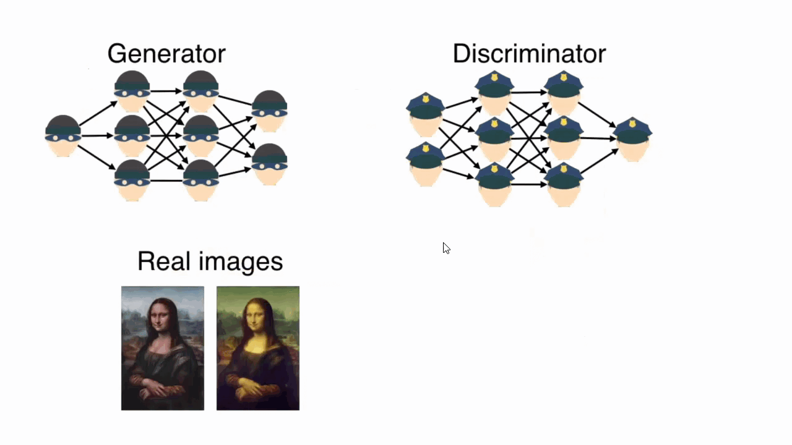

# GAN

### What is a GAN?
A GAN, short for **Generative Adversarial Network**, is like a two-player game where both players are super smart and are always trying to outwit each other. But instead of playing Fortnite or chess, these players are doing something way cooler—they’re creating things, like images, from scratch!

Here’s how it works:

### The Two Players
1. **The Generator**: This is like the “artist” in the game. The generator tries to create fake images that look so real that even an expert might be fooled. For example, it might try to create a picture of a cat that looks so lifelike, you'd think it's from your Instagram feed.

2. **The Discriminator**: This is like the “detective.” The discriminator’s job is to look at an image and decide if it’s real (like an actual photo of a cat) or fake (an image created by the generator). It’s constantly trying to catch the generator in the act.

### The Training Process (Step by Step)
1. **Starting Out**: At first, the generator is pretty bad at making images. The pictures it creates might look like a bunch of random pixels mashed together. The discriminator, on the other hand, is pretty good at spotting these fakes because they’re, well, terrible.

2. **The Feedback Loop**: Every time the generator creates a fake image, the discriminator checks it and gives feedback. If the image is obviously fake, the discriminator easily spots it and says, “Not today, faker!” But here’s the cool part: the generator uses this feedback to improve. It adjusts its strategy to make the next image a little bit better.

3. **Back and Forth**: This goes on in a loop—a bit like practicing a sport. The generator keeps trying to make better and better images, and the discriminator keeps getting better at spotting fakes. Over time, the generator improves so much that it can create images that are incredibly realistic. Meanwhile, the discriminator becomes a master detective, making the generator work even harder.

4. **When Things Get Good**: After lots and lots of practice, the generator gets so good that it can create images that are almost indistinguishable from real ones. At this point, even the discriminator might get fooled sometimes.

### The Inference (Using the GAN)
After the GAN has been trained, the generator can create new images anytime you want. Imagine telling the generator, "Hey, make me a picture of a dog!" and it does, instantly creating an image of a dog that looks like it was taken with a camera. This is called **inference**—using the trained GAN to generate new images.

### The Big Picture
So, in simple terms:
- **GANs** are like two competing players: one making things (the generator) and one judging things (the discriminator).
- They play a game where the generator tries to make something so realistic that the discriminator can’t tell if it’s fake or not.
- Through this competition, the generator gets really good at making realistic images, and we can then use it to create all sorts of cool things!

And hey, if this process were a school drama, the generator would be the sneaky student who’s always trying to sneak in fake homework, and the discriminator would be the strict teacher who’s always on the lookout for cheats. Over time, the student gets so good at faking the homework that even the teacher is impressed!

Pretty neat, right?

**[GAN working steps](https://chatgpt.com/share/5e34a1f2-3fab-41f8-a657-383bcf382af3)**
